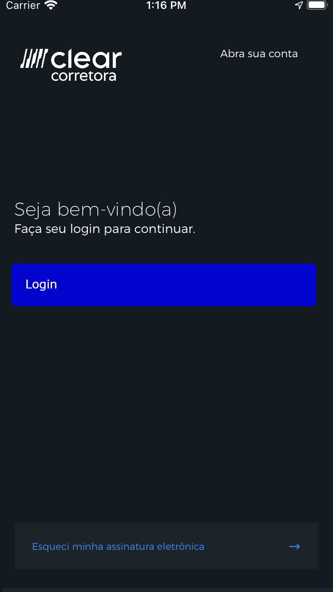
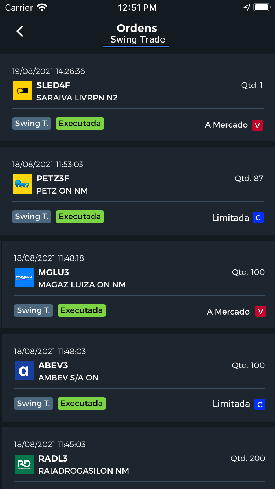

# Challenge Clear - Desenvolvedor Mobile
## Desafio Xamarin Forms

Nós 🥳, da Guilda Mobile da Clear Corretora sempre estamos em busca do melhor para nosso APP📱, hoje, feito em Xamarin Forms 💕. Não temos a melhor arquitetura, não temos o melhor código fonte, mas estamos em evolução 📈 constante para entregar o melhor para o nosso cliente 🥰. E dentre as estratégias, é reunir os melhores devs 💻 mobile que poderiamos ter. Por isso estamos lançando esse desafio para você 👊. 

O desafio é implementar um app 📱 onde podemos ver uma lista ordens enviadas a bolsa pelo nosso cliente.

## Features
- Criar uma lista performática e atraente
- Consumir uma lista de ordens via API REST
- Distâncias entre Margens não é importante. (Queremos testar a sua percepção)
- Tipo da fonte não é importante.
- Tamanho da fonte não é importante. (Queremos testar a sua percepção)

## Avaliação
 Tudo é permitido, pense como se esse APP fosse seu, você é o dono do negócio. Nossa avaliação será em cima de como você lidará com essa demanda; performance, tratamento de erros, layout. Questões de arquitetura, estrutura, plugins e code-smell também serão avaliados, porém lembre-se do famoso ditado do mundo dev: "não se usa bala de canhão para matar uma formiga"

## Protótipo

|   |  |
|:---:|:---:|
| Login | Listagem de Ordens |


#### Algumas especificações

| Cores | hexadecimal |
| ------ | ------ |
| Badge (verde) Status: "Executada" | #7cd444 |
| Badge (cinza) tipo da ordem: "Swing T." | #4d677e |
| Badge (vermelho) "V" para quando for uma venda | #7cd444 |
| Badge (azul) "C" para quando for uma compra | #052fff |
| Cor de Background  | #131a20 |
| Cor de Background do item da lista  | #1d262f |
| Cor botão do login  | #0404cf |

Link para "abra sua conta":
```sh
https://cadastro.clear.com.br/desktop/step/1
```

Logotipo da clear:
```sh
https://cadastro.clear.com.br/images/logos/clear-logo.png
```

Endpoint para API:
```sh
https://6123c2e6124d880017568476.mockapi.io/api/v1/swingtrade/orders
```

Exemplo modelo do item da lista JSON:
```sh
{
    "createdAt": "2021-08-23T09:21:44.521Z",
    "symbol": "ABEV3",
    "name": "AMBEV S/A ON",
    "quantity": "400",
    "type": "A Mercado",
    "side": "Compra",
    "module": "Swing Trade",
    "status": "Executada",
    "logo": "https://pro.clear.com.br/src/assets/symbols_icons/ABEV.png",
    "id": "1"
}
```

## Requisitos Essenciais

- [x] Usar Xamarin Forms > 5.0.0
- [x] Criar o layout com XAML
- [x] Projeto deve rodar no Android e iOS
- [x] Layout deve ser responsivo


## Bônus

- [ ] Testes de unidades
- [ ] Testes de interface

## Observações

- Ao final do desenvolvimento, abra um Pull Request direcionada á branch que foi passada a você
